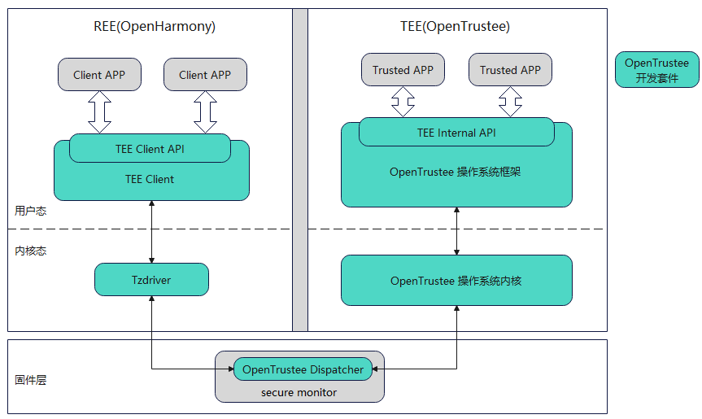

# tee_tee_os_kernel #

## Introduction ##

OpenTrustee provides a Trusted Execution Environment (TEE) that runs in a secure area isolated by hardware. OpenTrustee is a complete TEE solution that includes multiple components. The system architecture is shown in the figure below:



The tee_tee_os_kernel component mainly includes the kernel part of OpenTrustee, designed using a microkernel architecture.

## The specific module introduction of tee_tee_os_kernel ##
<table>
<th> Name of module </th>
<th> Introduction </th>
<tr>
<td> kernel/ipc </td><td> inter-process communication </td>
</tr><tr>
<td> kernel/irq </td><td> interrupt handling </td>
</tr><tr>
<td> kernel/mm </td><td> memory management </td>
</tr><tr>
<td> kernel/object </td><td> kernel object management </td>
</tr><tr>
<td> kernel/sched </td><td> thread scheduling </td>
</tr><tr>
<td> user/chcore-libs/sys-libs/libohtee </td><td> library functions that the framework depends on </td>
</tr><tr>
<td> user/system-services/system-servers/procmgr </td><td> process management </td>
</tr><tr>
<td> user/system-services/system-servers/fs_base </td><td> virtual file system </td>
</tr><tr>
<td> user/system-services/system-servers/fsm </td><td> file system management </td>
</tr><tr>
<td> user/system-services/system-servers/tmpfs </td><td> in-memory file system </td>
</tr><tr>
<td> user/system-services/system-servers/chanmgr </td><td> handle naming, indexing, and distribution of channels </td>
</tr>


</table>

## tee_tee_os_kernel code directories ##
```
base/tee/tee_os_kernel
├── kernel
│   ├── arch
│   ├── ipc
│   ├── irq
│   ├── lib
│   ├── mm
│   ├── object
│   ├── sched
│   └── syscall
├── tool
│   └── read_procmgr_elf_tool
├── user/chcore-libs
│   ├── sys-interfaces/chcore-internal
│   └── sys-libs/libohtee
└── user/system-services/system-servers
    ├── chanmgr
    ├── fs_base
    ├── fsm
    ├── procmgr
    └── tmpfs
```

## tee_tee_os_kernel building guide ##

The tee_tee_os_framework and tee_tee_os_kernel work together to build TEEOS, and the commands for building them separately are as follows:

```Bash
./build.sh --product-name rk3568 --build-target tee --ccache
```

Build the product as a TEEOS image:` base/tee/tee_os_kernel/kernel/bl32.bin`

## Related code repositories ##

[tee_os_framework](https://gitcode.com/openharmony-sig/tee_tee_os_framework)
