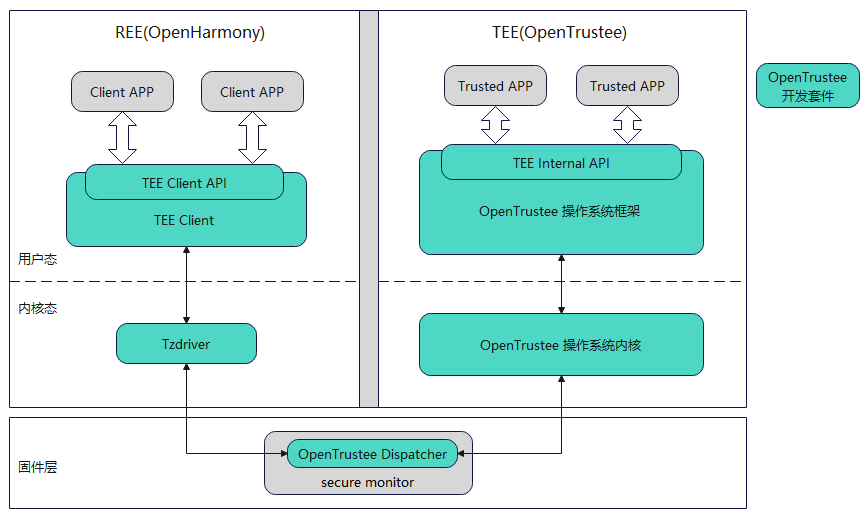

# tee_tee_os_kernel 仓介绍 #

## 简介 ##

OpenTrustee提供了一个可信执行环境（Trusted Execution Environment，TEE），运行在受硬件隔离的安全区域中。OpenTrustee是一套完整的TEE解决方案，包含多个部件，系统架构如图所示：



tee_tee_os_kernel 部件主要包含 OpenTrustee 的内核部分，采用微内核架构设计。

## tee_tee_os_kernel 部件模块划分 ##
<table>
<th>子模块名称</th>
<th>模块简介</th>
<tr>
<td> kernel/ipc </td><td> 进程间通信模块 </td>
</tr><tr>
<td> kernel/irq </td><td> 中断处理模块 </td>
</tr><tr>
<td> kernel/mm </td><td> 内存管理模块 </td>
</tr><tr>
<td> kernel/object </td><td> 内核对象管理 </td>
</tr><tr>
<td> kernel/sched </td><td> 线程调度模块 </td>
</tr><tr>
<td> user/chcore-libs/sys-libs/libohtee </td><td> 框架所依赖的库函数 </td>
</tr><tr>
<td> user/system-services/system-servers/procmgr </td><td> 负责进程管理，拥有所有进程的信息 </td>
</tr><tr>
<td> user/system-services/system-servers/fs_base </td><td> 虚拟文件系统模块 </td>
</tr><tr>
<td> user/system-services/system-servers/fsm </td><td> 文件系统管理模块 </td>
</tr><tr>
<td> user/system-services/system-servers/tmpfs </td><td> 内存文件系统模块 </td>
</tr><tr>
<td> user/system-services/system-servers/chanmgr </td><td> 管理 channel 的命名、索引及分发 </td>
</tr>


</table>

### tee_tee_os_kernel 部件代码目录结构 ###
```
base/tee/tee_os_kernel
├── kernel
│   ├── arch
│   ├── ipc
│   ├── irq
│   ├── lib
│   ├── mm
│   ├── object
│   ├── sched
│   └── syscall
├── tool
│   └── read_procmgr_elf_tool
├── user/chcore-libs
│   ├── sys-interfaces/chcore-internal
│   └── sys-libs/libohtee
└── user/system-services/system-servers
    ├── chanmgr
    ├── fs_base
    ├── fsm
    ├── procmgr
    └── tmpfs
```

## tee_tee_os_kernel 构建指导 ##
tee_tee_os_framework与tee_tee_os_kernel共同构建TEEOS，单独构建命令如下：

```Bash
./build.sh --product-name rk3568 --build-target tee --ccache
```

构建产物为TEEOS镜像：`base/tee/tee_os_kernel/kernel/bl32.bin`

### 开启 TEE 侧大模型推理支持 ###

TEE 侧大模型推理支持目前仅支持 RK3588 平台。使用该能力前，请确认 `config.mk` 同时满足：

```Makefile
CHCORE_PLAT=rk3588
CHCORE_LLM=ON
```

若 `CHCORE_PLAT` 不是 `rk3588`，即使设置 `CHCORE_LLM=ON`，RKNPU 相关 syscall、内核驱动、用户态接口和 LLM 构建打包流程也不会启用。

开启后，`build/build_tee.sh` 会在构建 TEEOS 时编译 `tee-llama.cpp`，并将推理所需动态库拷贝到 `ramdisk-dir`。

启用该能力时，REE 侧 Linux 设备树必须同步预留 TEE 侧大模型推理使用的物理内存，并将这些区域标记为 `no-map`，避免 REE 内核、CMA 或用户态进程分配和映射这些内存。当前 RK3588 配置下，REE 侧需要预留的内存区间如下：

| 起始地址 | 结束地址 | 用途 |
| --- | --- | --- |
| `0x02e00000` | `0x08000000` | TEE 侧推理可用内存 |
| `0x20000000` | `0x50000000` | RKNPU IOMMU 页表区域及 TEE 侧推理可用内存 |
| `0x60000000` | `0xC0000000` | TEE 侧推理可用内存 |
| `0x400000000` | `0x700000000` | TEE 侧推理可用高地址内存，仅适用于 32GB 内存规格开发板 |

上述区间对应 TEE 侧 `secure_ddr_region()` 配置。其中 `0x20000000` 到 `0x24000000` 为 RKNPU IOMMU 页表区域，后续 `0x24000000` 到 `0x50000000` 作为 TEE 侧推理可用内存。高地址区间 `0x400000000` 到 `0x700000000` 位于 16GB 以上地址空间，使用该区间时开发板必须具备 32GB 内存规格；非 32GB 开发板不得直接使用该高地址预留配置，需先调整 TEE 侧内存布局并同步更新设备树。

设备树示例如下。若板级设备树中已经存在 `reserved-memory` 节点，请将以下子节点合并到已有节点中：

```dts
reserved-memory {
    #address-cells = <2>;
    #size-cells = <2>;
    ranges;

    tee_llm_low0: tee-llm-low0@2e00000 {
        reg = <0x0 0x02e00000 0x0 0x05200000>;
        no-map;
    };

    tee_llm_low1: tee-llm-low1@20000000 {
        reg = <0x0 0x20000000 0x0 0x30000000>;
        no-map;
    };

    tee_llm_low2: tee-llm-low2@60000000 {
        reg = <0x0 0x60000000 0x0 0x60000000>;
        no-map;
    };

    tee_llm_high: tee-llm-high@400000000 {
        reg = <0x4 0x00000000 0x3 0x00000000>;
        no-map;
    };
};
```

上述地址需要与 TEE 侧 `kernel/arch/aarch64/plat/rk3588/mm/mmparse.c` 和 `kernel/include/arch/aarch64/plat/rk3588/machine.h` 中的内存配置保持一致。若调整 TEE 侧内存布局，必须同步更新 REE 侧设备树预留区域。原有 TEEOS/TZDRAM 预留内存配置仍需保留。

如需关闭该能力，可设置为：

```Makefile
CHCORE_LLM=OFF
```

## 相关仓

[tee_os_framework](https://gitcode.com/openharmony/tee_tee_os_framework)
